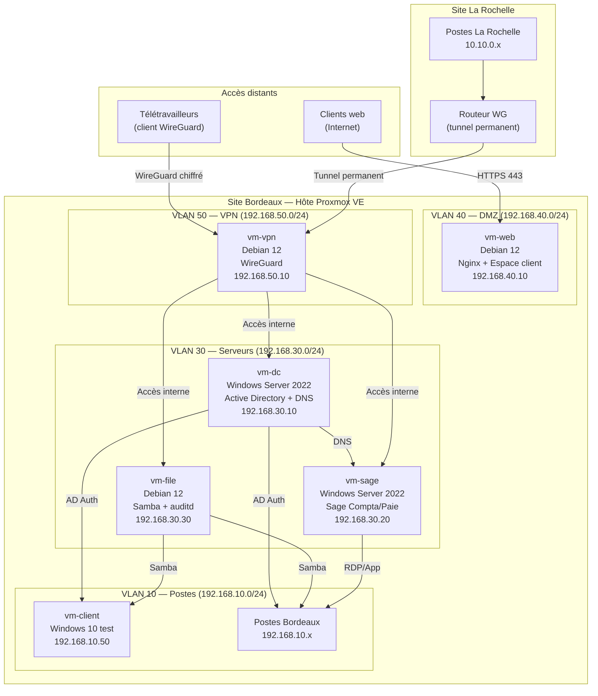

# Schéma — Architecture logique FIDUCIS

## Diagramme (Mermaid)



## Représentation textuelle

```
SITE BORDEAUX
┌──────────────────────────────────────────────────────────────┐
│                     Hôte Proxmox VE                          │
│                                                              │
│  VLAN 30 — Serveurs                                          │
│  ┌──────────────┐  ┌──────────────┐  ┌──────────────┐       │
│  │   vm-dc      │  │  vm-sage     │  │  vm-file     │       │
│  │ Win Srv 2022 │  │ Win Srv 2022 │  │  Debian 12   │       │
│  │ AD + DNS     │  │ Sage C/Paie  │  │ Samba+auditd │       │
│  │ .30.10       │  │ .30.20       │  │ .30.30       │       │
│  └──────────────┘  └──────────────┘  └──────────────┘       │
│                                                              │
│  VLAN 40 — DMZ          VLAN 50 — VPN                       │
│  ┌──────────────┐       ┌──────────────┐                     │
│  │   vm-web     │       │   vm-vpn     │                     │
│  │  Debian 12   │       │  Debian 12   │                     │
│  │ Nginx+Espace │       │  WireGuard   │                     │
│  │ .40.10       │       │ .50.10       │                     │
│  └──────────────┘       └──────────────┘                     │
│                               │                              │
│  VLAN 10 — Postes Bordeaux    │                              │
│  Postes (192.168.10.x)        │                              │
│  vm-client (.10.50)           │                              │
└──────────────────────────────────────────────────────────────┘
                               │
              ┌────────────────┼────────────────┐
              │                │                │
    ┌─────────────────┐  ┌─────────────┐  ┌───────────┐
    │ Site La Rochelle│  │Télétravaill.│  │Clients web│
    │ Routeur WG      │  │Client WG    │  │Internet   │
    │ 10.10.0.0/24    │  │10.20.0.0/24 │  │→ vm-web   │
    │ Postes: 10.10.x │  │             │  │           │
    └─────────────────┘  └─────────────┘  └───────────┘
```

## Flux de données sensibles (RGPD)

```
Collaborateur télétravail
        │
        │ WireGuard (chiffré)
        ▼
    vm-vpn (50.10)
        │
        │ VLAN interne
        ▼
    vm-file (30.30)  ←── auditd journalise chaque accès
        │
        │ Partage Samba
        ▼
    /srv/samba/clients/[nom-client]/
        │
        │ Snapshot quotidien
        ▼
    Proxmox Backup → NAS local → Cloud chiffré
```
