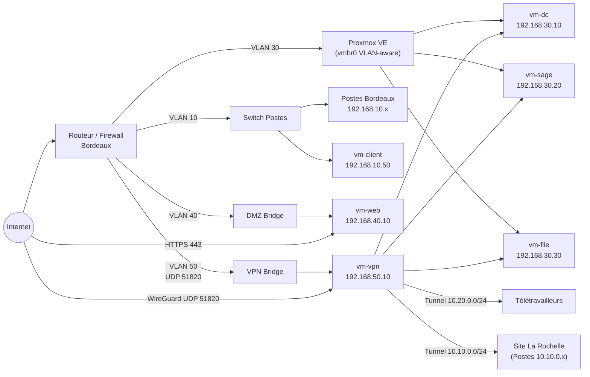

# Schéma — Réseau FIDUCIS

## Plan d'adressage

### Site Bordeaux

| VLAN | Nom | Réseau | Passerelle | Usage |
|---|---|---|---|---|
| 10 | Postes | 192.168.10.0/24 | 192.168.10.1 | Postes Bordeaux |
| 30 | Serveurs | 192.168.30.0/24 | 192.168.30.1 | VMs (DC, Sage, File) |
| 40 | DMZ | 192.168.40.0/24 | 192.168.40.1 | vm-web (public) |
| 50 | VPN | 192.168.50.0/24 | 192.168.50.1 | vm-vpn (WireGuard) |
| 99 | Management | 192.168.99.0/24 | 192.168.99.1 | Interface Proxmox |

### Réseaux VPN (tunnels WireGuard)

| Tunnel | Réseau | Usage |
|---|---|---|
| Télétravailleurs | 10.20.0.0/24 | Clients VPN individuels |
| La Rochelle | 10.10.0.0/24 | Réseau local du site secondaire |

## Hôtes fixes

| Hôte | IP | VLAN/Réseau |
|---|---|---|
| Proxmox (management) | 192.168.99.10 | VLAN 99 |
| vm-dc | 192.168.30.10 | VLAN 30 |
| vm-sage | 192.168.30.20 | VLAN 30 |
| vm-file | 192.168.30.30 | VLAN 30 |
| vm-web | 192.168.40.10 | VLAN 40 |
| vm-vpn | 192.168.50.10 | VLAN 50 |
| vm-client | 192.168.10.50 | VLAN 10 |

## Règles de flux inter-VLAN

| Source | Destination | Port | Autorisation |
|---|---|---|---|
| VLAN 10 (Postes) | VLAN 30 (Serveurs) | 445 (SMB), 3389 (RDP Sage) | ✅ Autorisé |
| Tunnel VPN télétravailleurs | VLAN 30 | 445, 3389 | ✅ Autorisé |
| Tunnel VPN La Rochelle | VLAN 30 | 445, 3389 | ✅ Autorisé |
| VLAN 40 (DMZ) | VLAN 30/10/50 | Tout | ❌ Bloqué |
| Internet | VLAN 40 | 80, 443 | ✅ Autorisé |
| Internet | VLAN 50 | 51820 UDP (WireGuard) | ✅ Autorisé |
| Internet | VLAN 30/10 | Tout | ❌ Bloqué |
| VLAN 30 | Internet | HTTPS (mises à jour) | ✅ Autorisé (sortant) |

## Diagramme réseau (Mermaid)



## Configuration WireGuard — vm-vpn

### Interface serveur (`/etc/wireguard/wg0.conf`)

```ini
[Interface]
Address = 10.20.0.1/24
ListenPort = 51820
PrivateKey = <PRIVATE_KEY_SERVEUR>

# Tunnel La Rochelle — point-to-point
[Peer]
PublicKey = <PUBLIC_KEY_LA_ROCHELLE>
AllowedIPs = 10.10.0.0/24
PersistentKeepalive = 25

# Exemple télétravailleur 1
[Peer]
PublicKey = <PUBLIC_KEY_TW1>
AllowedIPs = 10.20.0.2/32
```

### Client télétravailleur (exemple)

```ini
[Interface]
Address = 10.20.0.2/32
PrivateKey = <PRIVATE_KEY_TW>
DNS = 192.168.30.10  # vm-dc (DNS interne)

[Peer]
PublicKey = <PUBLIC_KEY_SERVEUR>
Endpoint = <IP_PUBLIQUE_BORDEAUX>:51820
AllowedIPs = 192.168.30.0/24, 192.168.10.0/24
PersistentKeepalive = 25
```
